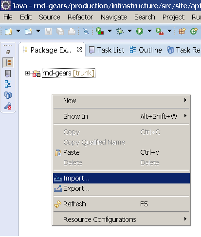
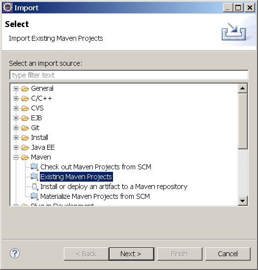
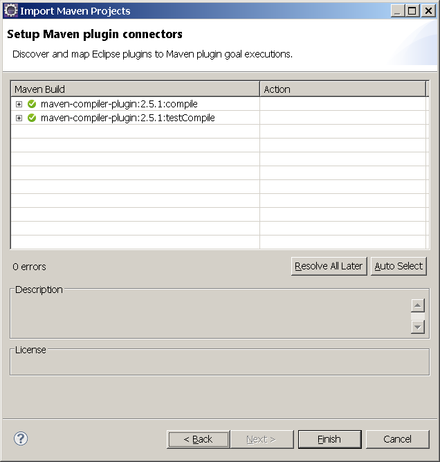
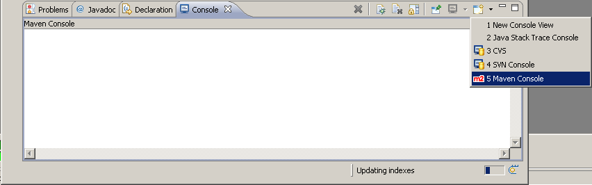
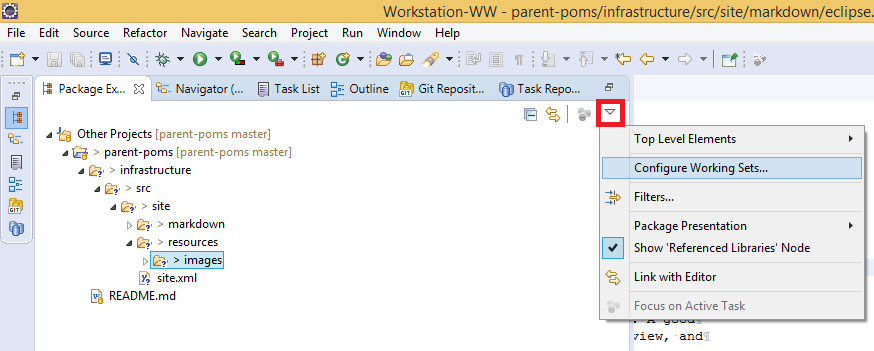

# Eclipse

## Table of Contents

## Installing

1. Download "Eclipse IDE for Enterprise Java Developers" 32 or 64 bits, depending
   of the platform (windows or linux). Recommended version is 
   https://www.eclipse.org/downloads/packages/.

2. Unzip the downloaded file on any folder in your file system.

3. Open eclipse and Switch to **Java Perspective** .

   a. `Window -> Open Perspective -> Java`

## Adding Additional Plug-ins

### Before Install

1. Go to `Window -> Preferences -> Install/Update -> Automatic Update -> Automatically find new updates and notify me`.

2. Restart eclipse, and wait for eclipse to look for updates.

3. If an update is available, a small icon will appear at the eclipse window 
   bottom right corner. Click on it and install all provided updates. Keep
   doing update until the icon no longer appears after an re-start.

### M2E Maven to Eclipse WTP (Web Tools Platform) Integration. 

1. Install it using market place. Open eclipse, go to 
   `Help -> Eclipse Market Place`  using eclipse menus.

2. Write **m2e for wtp** at the **Find** field and click **Go** .

3. Look the results for **Maven (Java EE) Integration for Eclipse for WTP (Luna/Mars?) 1.2.0** only.

4. Install it. If **Installed** button appears, it is because it is already installed. If an
   **Update**  button appears, it needs to be pressed to update from old to new version.

### M2E Maven Automatic Annotation Processor (APT)

1. Install it using market place. Open eclipse, go to 
   `Help -> Eclipse Market Place`  using eclipse menus.

2. Write **m2e-apt** at the **Find** field and click **Go** .

3. Look the results for **m2e-apt 1.5.2** only.

4. Install it. If **Installed** button appears, it is because it is already installed.

### Code Coverage EclEmma Plugin

1. Install it using market place. Open eclipse, go to 
   `Help -> Eclipse Market Place`  using eclipse menus.

2. Write **eclemma** at the **Find** field and click **Go** .

3. Look the results for **EclEmma Java Code Coverage** only.

4. Install it. If **Installed** button appears, it is because it is already installed.

### Trac and Jenkins MyLyn Connectors

1. `Window -> Show View -> Other... -> MyLyn -> Task Repositories` 

2. At the **Task Repositories** view, click with right mouse Button over
   the **Tasks** entry. Choose **Add Task Repository**.

3. If the Trac connector appears, it means it is already installed. If not,
   click **Add More Connectors...** button. Select **Trac**. 
   Click **Finish** button to install them.

4. `Window -> Show View -> Other... -> MyLyn -> Builds` .

5. Click **Create a build server...**. At the build server creation window,
   Add connector for jenkins if needed.

### Easy Shell

1. Install it using market place. Open eclipse, go to 
   `Help -> Eclipse Market Place`  using eclipse menus.

2. Write **easy shell** at the **Find**  field and click **Go** .

3. Look the results for **EasyShell 2.1.0** only.

4. Install it. If **Installed** button appears, it is because it is already installed.

### Bash Editor

1. Install it using market place. Open eclipse, go to 
   `Help -> Eclipse Market Place` using eclipse menus.

2. Write **bash editor** at the **Find** field and click **Go**.

3. Look the results for **Bash Editor 2.2.0** only.

4. Install it. If **Installed** button appears, it is because it is already installed.

### Windows Batch Files Editor

1. Install it using market place. Open eclipse, go to 
   `Help -> Eclipse Market Place` using eclipse menus.

2. Write **windows batch files** at the **Find** field and click **Go**.

3. Look the results for **Batch Editor 1.0.1** only.

4. Install it. If **Installed** button appears, it is because it is already installed.

### YAML Editor

1. Install it using market place. Open eclipse, go to 
   `Help -> Eclipse Market Place`  using eclipse menus.

2. Write **yaml editor** at the **Find** field and click **Go**.

3. Look the results for **Yaml Editor 1.6.1** only.

4. Install it. If **Installed** button appears, it is because it is already installed.

### Jenkinsfile Editor

1. Install it using market place. Open eclipse, go to 
   `Help -> Eclipse Market Place`  using eclipse menus.

2. Write **Jenkinsfile editor** at the **Find** field and click **Go**.

3. Look the results for **Jenkins Editor 1.7.0** only.

4. Install it. If **Installed** button appears, it is because it is already installed.

### PlantUML Plug-in

1. Install it using market place. Open eclipse, go to 
   `Help -> Eclipse Market Place`  using eclipse menus.

2. Write **plant uml** at the **Find** field and click **Go**.

3. Look the results for **PlantUML plugin 1.1.22** only.

4. Install it. If **Installed** button appears, it is because it is already installed.

5. Install Graphviz

   a. Get the package according with the platform at https://www.graphviz.org/download/.

   b. Follow the installer instructions.

   c. Restart eclipse if needed.

### Window Builder

1. `Help -> Install New Software...`

2. Click Add Button.

3. Enter **WindowBuilder** at the **Name** field and 
   http://download.eclipse.org/windowbuilder/latest/
   at the **Location** field. Click Ok. Wait till eclipse load all available
   plugins from that location.

4. Click **Select All**. Click **Next**. Keep moving forward till eclipse
   asks for installation of a new component. Confirm clicking **Ok** or
   **Yes** on all questions. After finishing, eclipse will ask for reboot.
   Answer **Yes** and waiting until eclipse restarts.

### Velocity Templates Editor

1. Install it using market place. Open eclipse, go to 
   `Help -> Eclipse Market Place`  using eclipse menus.

2. Write **veloedit** at the **Find** field and click <<Go>>.

3. Look the results for **veloedit 1.0.9** only.

4. Install it. If **Installed** button appears, it is because it is already installed.

## Configuring

### Edit Eclipse .ini File

#### Linux Ubuntu 18.04 LTS

##### Get and Install xulrunner

1. Get `xulrunner` binary from http://ftp.mozilla.org/pub/mozilla.org/xulrunner/releases/24.0/runtimes/.

2. Extract the contents to a folder inside user home, and memorize the absolute path to that folder.

##### Configure eclipse.ini

Go to the eclipse folder and open the `eclipse.ini`  file inside any text
editor. Right after the line having `openFile` , change the file so  
that it ends with following content:

```
...
...
--launcher.GTK_version
2
--launcher.appendVmargs
-vmargs
-Dosgi.requiredJavaVersion=1.6
-Dorg.eclipse.swt.browser.DefaultType=mozilla
-Dorg.eclipse.swt.browser.XULRunnerPath=/absolute/path/to/xulrunner
-XX:MaxPermSize=256m
-Xms40m
-Xmx1024m
```

##### Create Shell Script eclipse.sh

Create a shell script to invoke eclipse, with the following contents:

```bash
#!/bin/bash

export SWT_GTK3=0
/path/to/eclipse/executable/eclipse
```

#### Windows (7/8.1/10)

Go to the eclipse folder and open the `eclipse.ini` file inside any text
editor. Change the file so that it ends with the following content:

```
...
...
-Xms40m
-Xmx1024m
```

### Configuring the Environment

1. Window -> Show View -> Console

2. Window -> Preferences -> Team -> SVN -> SVN Interface -> SVNKit

3. Window -> Preferences -> Maven -> Download Artifact Sources

   a. Window -> Preferences -> Maven -> Download Artifact JavaDoc

   b. Window -> Preferences -> Maven -> Installations -> Add (point to the root of maven installation).
      Select the added installation.

   c.  Window -> Preferences -> Maven -> User Settings. Enter the
       fields to point to the right places for user and global settings (this
       last one should be the `settings.xml`  file inside the `conf` folder for
       the installation you just added at the previous step).          

4. Window -> Preferences -> General -> Editors -> Text Editors

   a. Check "Show line numbers"

   b. Check "Show print margin"

   c. Check "Insert spaces for tabs"

   d. Check "Show whitespace characters"

   e. Set Print Margin Column to 120

5. Window -> Preferences -> General -> Workspace

   a. Set "Text file encoding" to "UTF-8"

   b. Set "New text file line delimiter" to "Unix"
   
6. Window -> Preferences -> XML -> XML Files -> Editor

   a. Indent using spaces.
   
   b. Indentation size: 4

7. Windows -> Preferences -> Java -> Code Style -> Formatter

   a. Edit: Change the name and: 
    
      * set Indentation -> Tab Policy -> Spaces only      
       
      * set Indentation size to 4.
        
      * set Tab size to 4.
   
8. Window -> Show View -> Other... -> Maven -> Maven Repositories

9. Window -> Show View -> Other... -> PlantUML -> [Select All Tree Views]

10. Window -> Show View -> Other... -> MyLyn -> Builds

    a. Click with right button at the builds view and choose "Add Build Server...".

    b. Select Hudson/Jenkins and click **Next**.

    c. At the **Server** field, enter jenkins server address. Fullfil credentials
       if needed.

    d. Click **Validate**  button. The list of builds should be fulfilled. Press
       **Select All** and click **Next** or **Finish**.

## Importing Projects Using Maven

### Importing Projects

1. At the package explorer, right click the mouse and choose **Import**.

   

2. Select `Maven -> Existent Maven Projects`

   

3. Click **Browse** button and go to the root folder of the project you
   want to mount the project. Select the folder.

4. Eclipse will recursively search the folder and find all maven modules
   having a pom.xml. It will then show the modules. Click **Next** button to
   proceed.

5. Click **Finish** button to make eclipse start importing the projects. This
       can take some time, since eclipse will try to download source and javadoc
       packages for each dependency. You can check the importing progress by 
       selecting the **Maven Console** at the **Console View**.

   

   

### Observing Sources Download

During the project building inside eclipse, maven eclipse plugin will try
to download sources and javadoc packages for each dependency (if you correctly
checked the **Download Artifact Sources** option when previously configuring
eclipse. Some log information will be presented at the <<Maven Console View>>,
just like:

```
10/23/12 4:52:17 PM GMT-02:00: [INFO] Downloading http://xxxx/nexus/content/groups/public/com/itextpdf/itext-xtra/5.1.3/itext-xtra-5.1.3-sources.jar
10/23/12 4:52:19 PM GMT-02:00: [INFO] Downloaded http://xxxx/nexus/content/groups/public/com/itextpdf/itext-xtra/5.1.3/itext-xtra-5.1.3-sources.jar
10/23/12 4:52:19 PM GMT-02:00: [INFO] Downloaded sources for com.itextpdf:itext-xtra:5.1.3
```

At the package explorer you can see a small **sheet icon** closer to the 
dependency, showing that there is source package attached at that 
jar file dependency.

### Source Code Modules vs Parent Modules

Maven will typically create projects for two kinds of modules: (1) **source code** (packaging = jar, war);
(2) **parent modules** (packaging = pom). The first ones will be the modules where  you will 
effectively edit code. The second type will be just a container.

Source code modules have source and resources modules for code and test.

Parent modules does not have source code and resources folders. You can choose
to close parent modules, since they will not be usually edited or have relevant
files. 

### Organizing Projects Using Working Sets

Usually, there are several maven modules for just a single project. In order 
to improve the way you navigate through the sources or projects, you can use
**working sets**.

 

### Updating Maven Projects 

Sometimes maven projects are changed outside eclipse for a build from command
line. In these cases, sometimes, the project start presenting errors. A good
way to detect what these errors are, is to look at the **Problems** view, and
additionally invoke a maven project update.

### Building from Command Line

1. Right click over the folder where you want to build from command line.

2. Invoke the maven goals:

```bash
mvn clean install
```

### Invoking Specific Maven Goals

If you want to invoke specific custom goals, select **Maven Build...** and
fill in the goals you want. 
